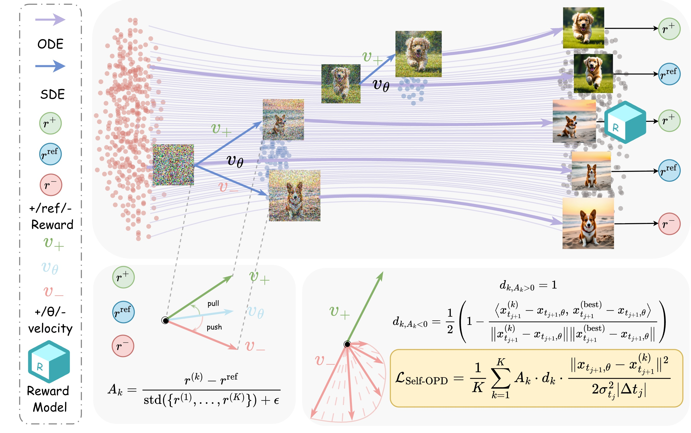
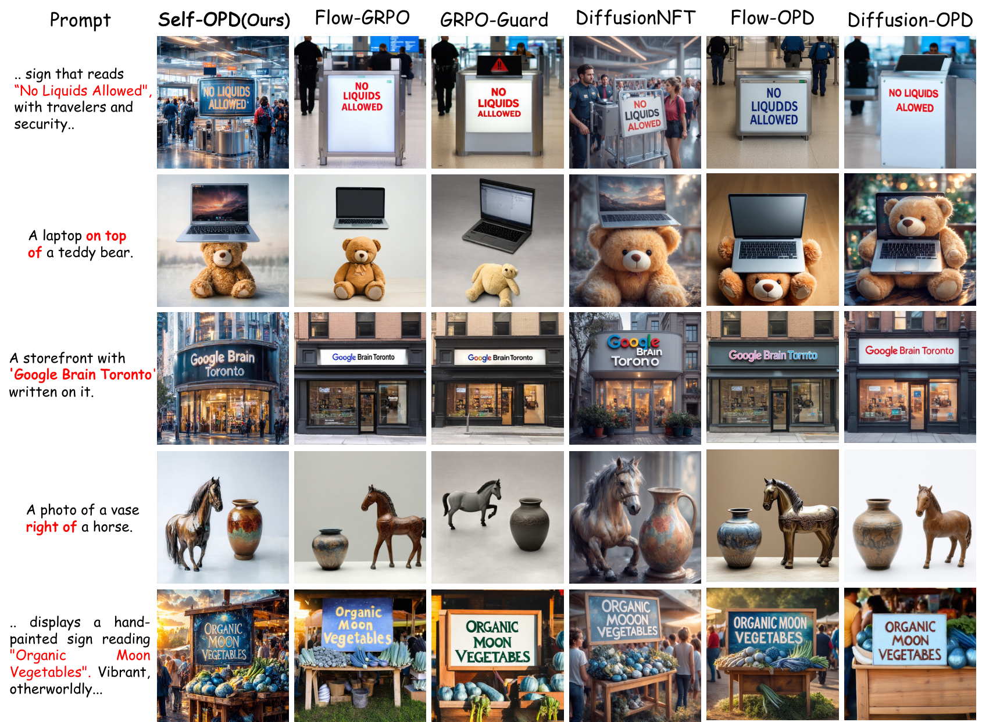
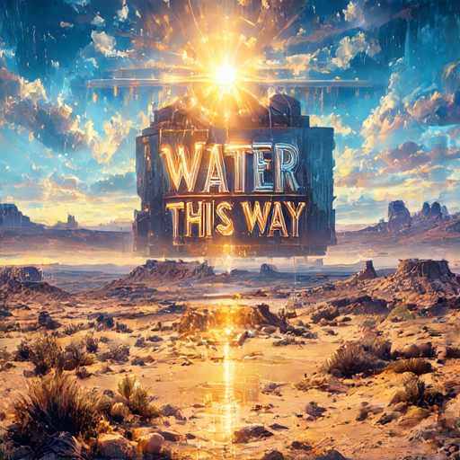
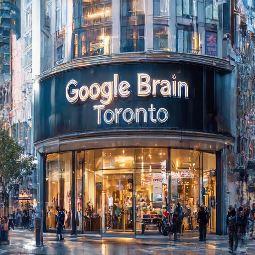

<h1 align="center">Self-OPD: On-Policy Distillation for Flow Matching Models without Teacher</h1>

<p align="center">
  <a href="https://github.com/Shiy-Zhang/Self-OPD">Code</a> ·
  <a href="https://huggingface.co/ShiyiZhang/Self-OPD">Model</a> ·
  <a href="LICENSE">License</a>
</p>

## Overview

**Self-OPD** is a teacher-free, on-policy distillation framework for flow-matching text-to-image models. It turns the current policy's self-exploration into dense, step-wise supervision without training a separate task-specific teacher.

At each denoising step, Self-OPD samples multiple stochastic SDE branches around the deterministic next-state prediction, rolls each branch out with an ODE sampler, and compares its reward against a deterministic self-reference baseline. The resulting normalized advantages drive an all-branch pull-push objective with direction-aware attenuation and SDE-variance normalization. For multi-objective alignment, normalized scores are fused at the reward level to avoid direct gradient conflict.

This release provides the general Self-OPD training implementation, an SD3.5-Medium recipe using OCR as the first public reward example, standalone inference, and the evaluation protocol used for the paper. Additional reward configurations and checkpoints will be released progressively.

## Method

- **Teacher-free dense supervision:** local exploration replaces a separately trained teacher while retaining per-step distillation targets.
- **All-branch learning:** both positive and negative branches contribute to the update instead of discarding all but the best sample.
- **Direction-aware updates:** repulsion is attenuated when it conflicts with the best local direction.
- **Reward-level fusion:** black-box rewards are combined before branch selection, avoiding direct gradient competition between reward models.

<p align="center">
  
</p>

## Results

<p align="center">
  
</p>

## Environment Setup

Python 3.10 or newer is recommended.

```bash
git clone https://github.com/Shiy-Zhang/Self-OPD.git
cd Self-OPD

python -m venv .venv
source .venv/bin/activate
pip install -r requirements.txt
```

Install the PaddlePaddle build appropriate for the local CPU/CUDA environment before OCR training or evaluation. GenEval additionally requires compatible MMDetection and MMCV builds; follow the [MMDetection installation guide](https://mmdetection.readthedocs.io/en/latest/get_started.html) for the installed PyTorch and CUDA versions.

## Model Download

Model weights are hosted on the Hugging Face Hub and are not stored in this repository.

| Component | Hugging Face repository |
|---|---|
| Base model | [`stabilityai/stable-diffusion-3.5-medium`](https://huggingface.co/stabilityai/stable-diffusion-3.5-medium) |
| Self-OPD LoRA | [`ShiyiZhang/Self-OPD`](https://huggingface.co/ShiyiZhang/Self-OPD) |

The training, inference, and evaluation scripts accept either a local path or a Hugging Face model ID. Hugging Face weights are downloaded and cached automatically on first use. Make sure the base model's access conditions have been accepted and authenticate with `hf auth login` when required.

## Training

Multi-GPU training uses the paper-scale defaults of eight processes, eight branches, and sixteen samples per prompt:

```bash
bash scripts/train_multi_gpu.sh
```

Set `NUM_PROCESSES` to use a different number of GPUs. A reduced single-GPU configuration is provided for functional testing and smaller experiments; it is not the paper-scale setting:

```bash
bash scripts/train_single_gpu.sh
```

## Inference

`scripts/infer.sh` loads the released LoRA directly from the Hugging Face Hub and regenerates the three showcase samples below:

```bash
bash scripts/infer.sh
```

Each sample uses the defaults in `scripts/infer.py` (**bfloat16**, 40 inference steps, guidance scale 4.5, 512×512, `max_sequence_length=256`). For a single prompt the image generator is seeded with exactly `--seed`, so each command below regenerates the image above it.

| Sample | Prompt | Seed |
| --- | --- | --- |
|  | A vast desert landscape under a scorching sun, where a mirage forms the shimmering letters "Water This Way" on the distant horizon, creating an illusion of hope in an otherwise barren and arid environment. | 142 |
|  | A storefront with 'Google Brain Toronto' written on it. | 215 |
|  | A laptop on top of a teddy bear. | 268 |

```bash
python scripts/infer.py \
  --prompt "A vast desert landscape under a scorching sun, where a mirage forms the shimmering letters \"Water This Way\" on the distant horizon, creating an illusion of hope in an otherwise barren and arid environment." \
  --seed 142

python scripts/infer.py \
  --prompt "A storefront with 'Google Brain Toronto' written on it." \
  --seed 215

python scripts/infer.py \
  --prompt "A laptop on top of a teddy bear." \
  --seed 268
```

> Diffusion sampling is deterministic for a fixed seed within one environment, but minor pixel-level differences can appear across GPU / CUDA / library versions. The generated content matches the samples above.

## Evaluation

The unified evaluator generates each required benchmark once and reuses the GenEval/OCR images for the same-test-image PickScore and HPSv2 scores. For the separate-test-set scores, PickScore uses DrawBench and HPSv2 uses Pick-a-Pic.

Download the official [GenEval](https://github.com/djghosh13/geneval) Mask2Former configuration/checkpoint and the official [HPSv2](https://github.com/tgxs002/HPSv2) checkpoint, then run:

```bash
export GENEVAL_DETECTOR_CONFIG=/path/to/mask2former_config.py
export GENEVAL_DETECTOR_CHECKPOINT=/path/to/mask2former_checkpoint.pth
export HPSV2_CHECKPOINT=/path/to/HPS_v2.1_compressed.pt

bash scripts/evaluate.sh \
  --lora-path ShiyiZhang/Self-OPD \
  --output-dir outputs/evaluation \
  --metrics all
```

The evaluator reports GenEval strict and continuous accuracy, OCR character-level accuracy, PickScore and HPSv2 on the GenEval/OCR images (“same test images”), PickScore on held-out DrawBench prompts, and HPSv2 on held-out Pick-a-Pic prompts (“separate test set”).

## Repository Layout

```text
configs/                  Training configurations
data/                     OCR, GenEval, Pick-a-Pic, and DrawBench prompts and metadata
scripts/train.py          Self-OPD training implementation
scripts/train_*_gpu.sh    Single- and multi-GPU training launchers
scripts/infer.py/.sh      SD3.5-Medium LoRA inference and launcher
scripts/evaluate.py/.sh   End-to-end paper evaluation and launcher
self_opd/                 Self-OPD objective, rewards, and evaluation modules
```

## Acknowledgements

Self-OPD is implemented with [Hugging Face Diffusers](https://github.com/huggingface/diffusers), [Accelerate](https://github.com/huggingface/accelerate), and [PEFT](https://github.com/huggingface/peft). Parts of the SD3 sampling and prompt-encoding helpers are adapted from Diffusers under the Apache License 2.0, and the stochastic flow transition follows the public implementation pattern from [ddpo-pytorch](https://github.com/kvablack/ddpo-pytorch). Evaluation uses the official GenEval, PaddleOCR, PickScore, and HPSv2 implementations; benchmark sources are documented in [data/README.md](data/README.md).

## Citation

```bibtex
@article{zhang2026self,
  title={Self-OPD: On-Policy Distillation for Flow Matching Models without Teacher},
  author={Zhang, Shiyi and Liu, Mushui and Tong, Yunze and He, Wanggui and Zou, Siyu and Liu, Jinlong and Yu, Yunlong and Song, Jian and Jiang, Hao and Huang, Pipei and others},
  journal={arXiv preprint arXiv:2608.26872},
  year={2026}
}
```

## License

Released under the [MIT License](LICENSE).

